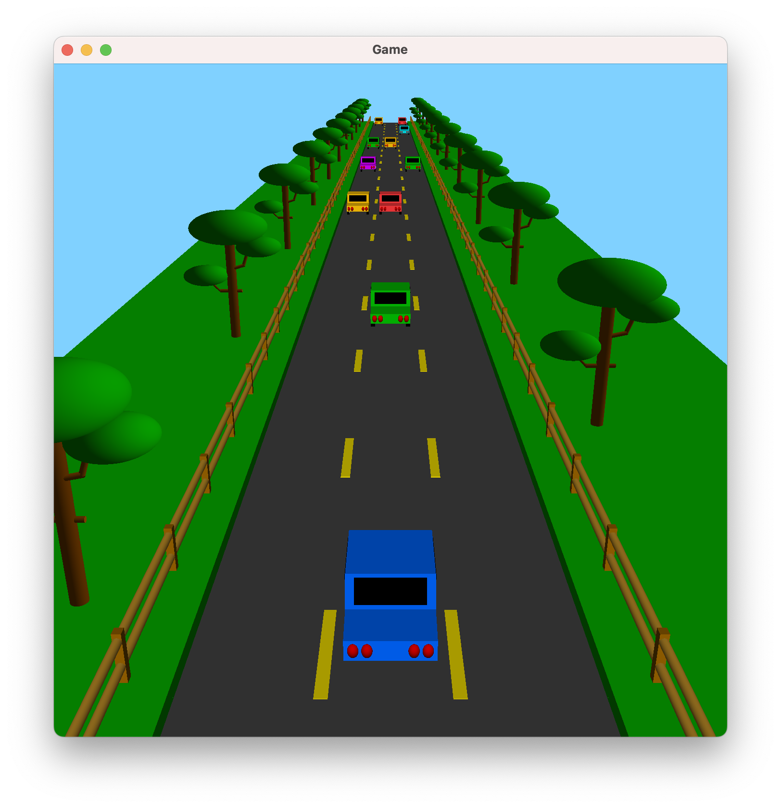

# About

This game was originally created in 2021 as the final project for my computer graphics class. 

The game is based off of an endless runner game. You are driving a car down the road, and you must avoid colliding with stationary cars ahead of you. You gain a point each time you pass a row of cars, but the game becomes increasingly difficult as time moves on because your forward speed gradually increases.

All the objects in the game are constructed using basic shapes, namely spheres, cylinders, and squares. They are then rendered on OpenGL with some basic shaders to give a sense of depth.

# Installation

You will need to make sure CMake and GLFW (OpenGL library) are installed on your machine. Then, run the following commands to build everything: 

```
cmake .
make
```

Once done, there will be an executable called `game`. 

# Playing the game

To run the game, run 
```
./game
```

A window like below will appear:


Use the right and left arrow keys to move the vehicle left and right into different lanes. If you collide with a vehicle on the road, your game will end, and your final score will be displayed on your terminal window. Then, you can either press the space bar to play again, or close the window to exit.

Note, the game may be faster or slower on different machines. If the initial speed seems too fast or too slow, change the variable `defaultForwardSpeed` in game.cxx up or down, then run `make` to rebuild the executable.